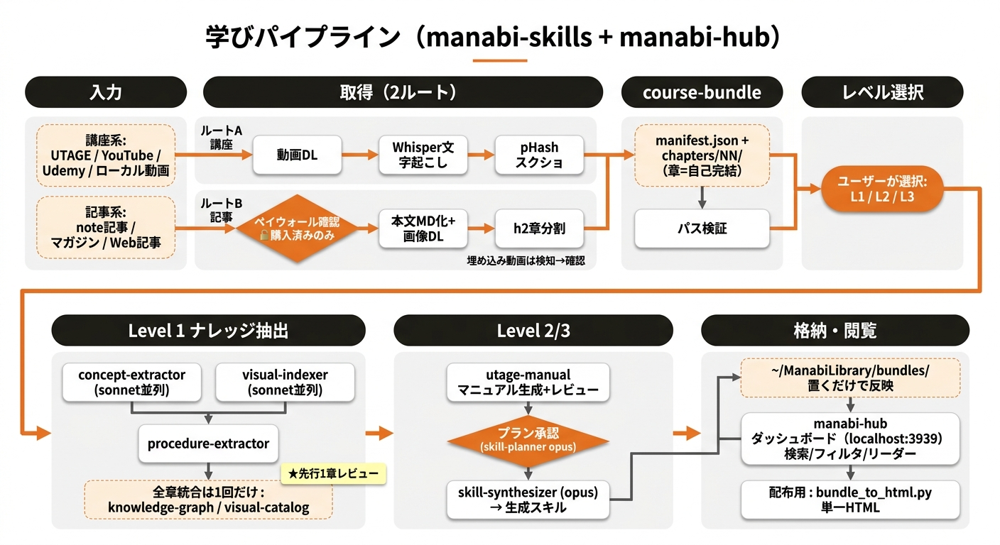

# Manabi Skills

動画講座・有料記事を「読めるマニュアル＋構造化ナレッジ＋実行可能スキル」に変換するClaude Codeスキル集。

## パイプライン図



## できること

### 2ルート対応

| ルート | 入力 | 主素材 |
|--------|------|--------|
| **A: 講座ルート** | UTAGE / YouTube / Udemy / ローカル動画 | 動画の文字起こし＋スクリーンショット |
| **B: 記事ルート** | note記事・マガジン（自分が購入済みのもののみ） | 本文＋記事内画像 |

どちらも同じ course-bundle 形式に正規化されて以降のパイプラインに合流します。

### 3レベル処理

| レベル | 内容 |
|--------|------|
| **L1: ナレッジ抽出** | 概念・暗黙知・手順・画像を構造化 → `knowledge.json` / `visual-index.json` / `procedures.json` |
| **L2: マニュアル生成** | L1 + 画像付き Markdown マニュアル（人間が読めるもの） |
| **L3: スキル化** | L2 + 実行可能な Claude Code スキルを自動生成 |

処理レベルは course-bundle 完成後にユーザーが選択します（勝手に始めません）。

### 学びホーム（~/ManabiLibrary）

取り込んだ全教材を一元管理するライブラリフォルダ。初回起動時に場所を確認して以後は自動で格納します（デフォルト: `~/ManabiLibrary`）。

### 閲覧方法

- **manabi-hub ダッシュボード**: https://github.com/naoterumaker/manabi-hub — 蔵書が並ぶWebダッシュボード。検索・フィルタ・リーダー・テーマ切替付き（Node.js 18+ が必要）
- **単一HTML書き出し**: `bundle_to_html.py` で依存ゼロの1ファイルHTML生成。配布・共有向け

## Quick Start

### 1. インストール

```bash
# 全スキル一括インストール（Claude Code向け）
npx skills add naoterumaker/manabi-skills -g -a claude-code -y --copy

# 特定スキルだけ入れる場合
npx skills add naoterumaker/manabi-skills -g -a claude-code --skill manabi-ingest -y --copy
```

### 2. 起動

Claude Codeで以下のようにトリガーします:

```
講座を取り込んで
```

`/manabi-ingest` スキルが起動し、入力タイプ判定 → ヒアリング → 処理計画提示の順に進みます。

初回起動時には**学びホームのセットアップ**と**manabi-hubダッシュボードのセットアップ**を提案します。

### 3. 必要な API キー

文字起こしに **Groq Whisper API** を使用します（無料枠あり）。

```bash
cd ~/.claude/skills/utage-manual
cp .env.example .env
# .env を開いて GROQ_API_KEY=gsk_... を入れる
```

API キー発行: https://console.groq.com/keys

## スキル一覧

| スキル | 役割 |
|--------|------|
| **manabi-ingest** | オーケストレーター。入力タイプ判定→DL→文字起こし→スクショ抽出→course-bundle作成→レベル選択（L1/L2/L3） |
| **utage-manual** | UTAGE特化の取り込み＋画像付きMarkdownマニュアル生成（Groq Whisperで文字起こし） |
| **video-downloader** | yt-dlpラッパー。YouTube/Loom/Vimeo等から動画ダウンロード |
| **concept-extractor** | トランスクリプトから概念・暗黙知・引用を構造化抽出 → `knowledge.json` |
| **visual-indexer** | 全スクリーンショットを分類・OCR・タグ付け → `visual-index.json` |
| **procedure-extractor** | UI操作・設定手順を抽出してスクショと紐付け → `procedures.json` |
| **skill-planner** | 抽出結果から「何のスキルが作れるか」計画 → `skill-plan.json`（要承認） |
| **skill-synthesizer** | skill-plan.json から複数の Claude Code スキルを自動生成 |

## 必要環境

| 要件 | 用途 |
|------|------|
| Python 3.10+ | 各種スクリプト実行 |
| ffmpeg | 動画分割・音声抽出（`brew install ffmpeg`） |
| GROQ_API_KEY | 文字起こし（`.env` ファイルに保存） |
| Chrome + Claude in Chrome | UTAGE / note 記事の取り込み時 |
| Node.js 18+ | manabi-hubダッシュボード利用時のみ |

`imagehash`, `Pillow` も必要です（スクリーンショット重複排除）:

```bash
pip install imagehash Pillow
```

## 既知の制限

- **noteマガジン・hybrid（動画入り記事）ルートは未検証（β）**: 初回実行時はサンプルレビューを厚めに行ってください
- **Brainアダプタ未実装**: brain-market.com はフォールバック手順（DOM調査）で対応しますが本文セレクタは未確定です
- **動画タイムスタンプとスクリーンショットの紐付け精度**: pHash モードで自動調整しますが、高速スクロール等でフレーム抜けが発生することがあります

## インストール / 更新 / 削除

```bash
# 更新
npx skills update -g

# 削除
npx skills remove manabi-ingest -g

# スキル一覧表示
npx skills add naoterumaker/manabi-skills --list
```

## ライセンス

MIT

## クレジット

- Skills CLI: [Vercel Skills](https://github.com/vercel-labs/skills)
- 文字起こし: [Groq Whisper](https://console.groq.com/)
